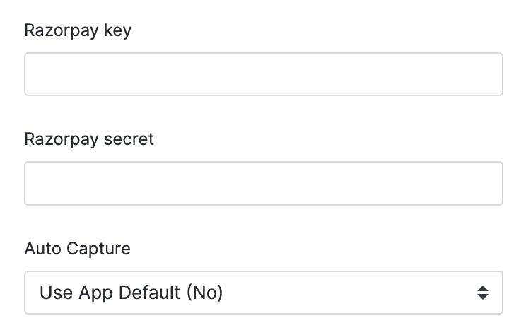

# Solidus Razorpay

[](https://circleci.com/gh/solidusio-contrib/solidus_razorpay)
[](https://codecov.io/gh/solidusio-contrib/solidus_razorpay)

<!-- Explain what your extension does. -->

## Installation

Add solidus_razorpay to your Gemfile:

```ruby
gem 'solidus_razorpay'
```

Bundle your dependencies and run the installation generator:

```shell
bin/rails generate solidus_razorpay:install
```

## Usage

You have to go through the following steps to start using this extension to accept payments for your store.
1. Go to the admin side of solidus and create a new payment method
2. Select the `Razorpay payment` option in the Type field.
3. Give the Payment Method a name and description and save it.
4. You should get the following options

5. Fill in the Key and Secret you got from your Razorpay account, also set the auto capture value to what is set for your razorpay account.
6. That's it, this should allow the option of paying through Razorpay to show up for your orders.

#### Alternatively
1. While creating the Payment Method you can select the `razorpay_credentials` option in the Preference Source field.
2. This allows the Payment Method to use the environment variables `RAZORPAY_KEY` and `RAZORPAY_SECRET` to set the key and secret for the Payment Method.
3. This would allow option of paying through Razorpay to show up for your orders.

### Testing the extension

First bundle your dependencies, then run `bin/rake`. `bin/rake` will default to building the dummy
app if it does not exist, then it will run specs. The dummy app can be regenerated by using
`bin/rake extension:test_app`.

```shell
bin/rake
```

To run [Rubocop](https://github.com/bbatsov/rubocop) static code analysis run

```shell
bundle exec rubocop
```

When testing your application's integration with this extension you may use its factories.
Simply add this require statement to your `spec/spec_helper.rb`:

```ruby
require 'solidus_razorpay/testing_support/factories'
```

Or, if you are using `FactoryBot.definition_file_paths`, you can load Solidus core
factories along with this extension's factories using this statement:

```ruby
SolidusDevSupport::TestingSupport::Factories.load_for(SolidusRazorpay::Engine)
```

### Running the sandbox

To run this extension in a sandboxed Solidus application, you can run `bin/sandbox`. The path for
the sandbox app is `./sandbox` and `bin/rails` will forward any Rails commands to
`sandbox/bin/rails`.

Here's an example:

```
$ bin/rails server
=> Booting Puma
=> Rails 6.0.2.1 application starting in development
* Listening on tcp://127.0.0.1:3000
Use Ctrl-C to stop
```

### Updating the changelog

Before and after releases the changelog should be updated to reflect the up-to-date status of
the project:

```shell
bin/rake changelog
git add CHANGELOG.md
git commit -m "Update the changelog"
```

### Releasing new versions

Please refer to the dedicated [page](https://github.com/solidusio/solidus/wiki/How-to-release-extensions) on Solidus wiki.

## License

Copyright (c) 2021 [name of extension author], released under the New BSD License.
